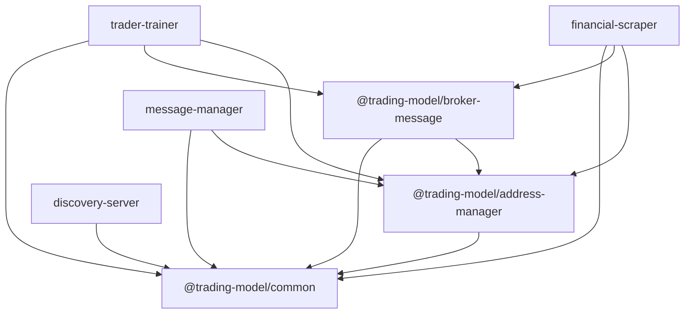

# Architecture — API Reference

This directory documents the public interface of every package and service in the **trading-model** monorepo.

## Overview

This project is an **AI-driven trading platform** built as a **monorepo** using npm workspaces. It ingests heterogeneous data (market, financial, economic, social), trains transformer-based models and reinforcement learning agents (optimized by a genetic algorithm), and eventually executes trades through a centrally monitored gateway.

The system is in **early development**. No component is production-ready.

## Packages

| Package                          | Path                        | Documentation                              |
| -------------------------------- | --------------------------- | ------------------------------------------ |
| `@trading-model/common`          | `packages/common/`          | [common.md](./common.md)                   |
| `@trading-model/address-manager` | `packages/address-manager/` | [address-manager.md](./address-manager.md) |
| `@trading-model/broker-message`  | `packages/broker-message/`  | [broker-message.md](./broker-message.md)   |

## Services

| Service           | Path                          | Documentation                                  |
| ----------------- | ----------------------------- | ---------------------------------------------- |
| discovery-server  | `services/discovery-server/`  | [discovery-server.md](./discovery-server.md)   |
| message-manager   | `services/message-manager/`   | [message-manager.md](./message-manager.md)     |
| financial-scraper | `services/financial-scraper/` | [financial-scraper.md](./financial-scraper.md) |
| trader-trainer    | `services/trader-trainer/`    | [trader-trainer.md](./trader-trainer.md)       |

## Dependency Graph

```
@trading-model/common
  ↑                    ↑
  |                    |
@trading-model/        |
address-manager        |
  ↑                    |
  |                    |
@trading-model/broker-message ---
  ↑         ↑           ↑          ↑
  |         |           |          |
Discovery  Financial   Message    Trader-
Server     Scrapper    Manager    Trainer
```

### mermaid



## Technology Stack

| Layer      | Technology                                           |
| ---------- | ---------------------------------------------------- |
| Runtime    | Node.js                                              |
| Language   | TypeScript (ES2020; module: node16 or commonjs)      |
| API        | Express.js                                           |
| Security   | mTLS (all services)                                  |
| Database   | MongoDB (message-manager), MySQL (financial-scraper) |
| Validation | Zod                                                  |
| Scheduling | node-cron                                            |
| Formatting | Prettier                                             |
| Linting    | ESLint 10 flat config                                |

## Security Model

- All inter-service communication uses **HTTPS with mutual TLS** (mTLS).
- No service trusts another without explicit certificate validation.
- The Discovery-Server issues and rotates tokens.
- Live trading will be gated by risk limits, capital exposure constraints, and fail-safe mechanisms (planned).

## Known Technical Debt

1. **Mixed test conventions**: Both `.spec.ts` and `.test.ts` suffixes used across services.
2. **Legacy `config/*` path alias**: Some service tsconfigs still define a `config/*` path alias (`./src/config/*`) that should be replaced with `node16` resolution.
3. **ESLint warnings**: ~50 lint errors remain across the codebase (unused variables, `any` types, empty interfaces, prefer-const).
