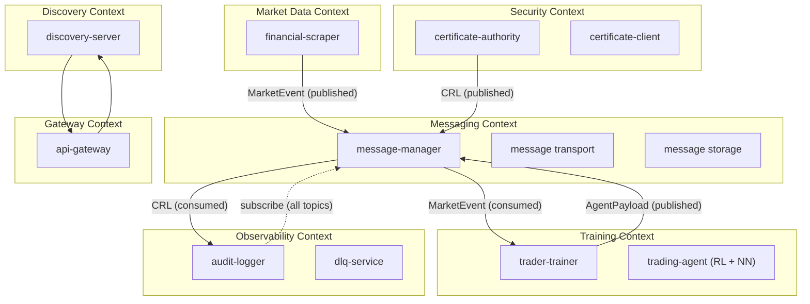

# Bounded Contexts — trading-model

This document defines the Domain-Driven Design (DDD) bounded contexts for the trading-model platform.

## Context Map

## Contexts Defined

### 1. Market Data Context

- **Owner:** `financial-scraper`
- **Core entities:** Candle, Trade, Ticker, OrderBook
- **External dependency:** Binance API
- **Publishes:** `market.trade.recent.fetch`, `market.candlestick.series.fetch`, `market.order-book.snapshot.fetch`, `market.ticker.24hr-stats.fetch`, `market.price-ticker.snapshot.fetch`, `market.order-book-ticker.snapshot.fetch`
- **Debug events:** `example.debug.create`, `example.show.create`

### 2. Training Context

- **Owner:** `trader-trainer`
- **Sub-contexts:** `genetic-algorithm` (population evolution), `neural-network` (agent learning)
- **Core entities:** Genome, Agent, Wallet, Experience
- **Consumes:** Market events from Market Data Context
- **Publishes:** Agent payloads (best agent after each generation)

### 3. Messaging Context

- **Owner:** `message-manager`
- **Core entities:** Message, Subscription, DeliveryAttempt, DeadLetter
- **Responsibilities:** Topic routing, delivery guarantees, retry, DLQ routing
- **Internal interfaces:** MessageDeliveryPort, SubscriptionStore, MessageStore

### 4. Security Context

- **Owner:** `certificate-authority`
- **Client library:** `certificate-client`
- **Core entities:** Certificate, CSR, CRL, KeyPair
- **Publishes:** CRL updates to Audit Context (`certificate.revoked`, `ca.key.rotated`)

### 5. Discovery Context

- **Owner:** `discovery-server`
- **Core entities:** ServiceInstance, Lease
- **Responsibilities:** Registration, heartbeat, token management

### 6. Observability Context

- **Owner:** `audit-logger` + `dlq-service`
- **Core entities:** AuditEvent, DeadLetterEntry
- **Consumes:** All published events for audit trail
- **Internal events:** `audit.heartbeat`, `audit.gap.detected`
- **Publishes:** Replay requests (DLQ → Message Manager)

### 7. Gateway Context

- **Owner:** `api-gateway`
- **Core entities:** Route, CacheEntry
- **Responsibilities:** Auth, rate limiting, caching, proxying

## Integration Patterns

| Relationship           | Pattern              | Implementation                        |
| ---------------------- | -------------------- | ------------------------------------- |
| Market Data → Training | Pub/Sub (async)      | Message Manager topics                |
| Any → Audit            | Pub/Sub (async)      | Audit-logger subscribes to all topics |
| Services → Discovery   | Request/Reply (sync) | HTTPS mTLS                            |
| Services → Security    | Request/Reply (sync) | HTTP mTLS CSR signing                 |
| External → Platform    | Proxy (sync)         | API Gateway                           |

## Migration from Current State

The codebase currently has `EnumEventMessage` mixing market data, certificate, and audit topics in a single enum. A future refactoring should:

1. Split `EnumEventMessage` into per-context enums (`MarketEvent`, `SecurityEvent`, `AuditEvent`)
2. Define per-context message schemas in Zod
3. Use context-specific topics in the message-manager subscription model
