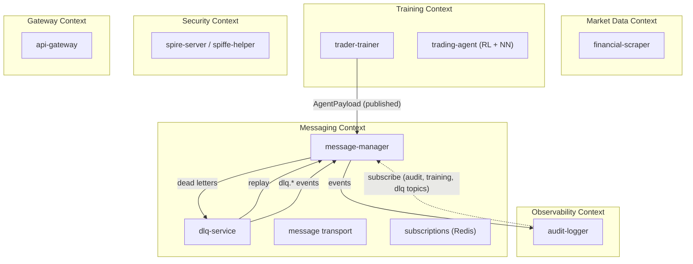

# Bounded Contexts — trading-model

This document defines the Domain-Driven Design (DDD) bounded contexts for the trading-model platform.

## Context Map

```mermaid
graph TD
    subgraph "Market Data Context"
        FS["financial-scraper"]
    end
    subgraph "Training Context"
        TT["trader-trainer"]
        TS["trading-agent (RL + NN)"]
    end
    subgraph "Messaging Context"
        MM["message-manager"]
        DLQ["dlq-service"]
        MT["message transport"]
        SUB["subscriptions (Redis)"]
    end
    subgraph "Security Context"
        SP["spire-server / spiffe-helper"]
    end
    subgraph "Observability Context"
        AL["audit-logger"]
    end
    subgraph "Gateway Context"
        GW["api-gateway"]
    end

    TT -->|"AgentPayload (published)"| MM
    MM -->|"events"| AL
    AL -.->|"subscribe (audit, training, dlq topics)"| MM
    MM -->|"dead letters"| DLQ
    DLQ -->|"replay"| MM
    DLQ -->|"dlq.* events"| MM
```

## Contexts Defined

### 1. Market Data Context

- **Owner:** `financial-scraper`
- **Core entities:** Candle, Trade, Ticker, OrderBook
- **External dependency:** Binance API
- **Publishes:** nothing since ADR-0078: the trainer reads candles through the scraper API.
- **Signals (ADR-0036):** collected and served at `GET /financial-scraper/signals/assets/:assetId`; **no consumer yet** (trader-trainer and model-evaluator do not read them).

### 2. Training Context

- **Owner:** `trader-trainer`
- **Sub-contexts:** `genetic-algorithm` (population evolution), `neural-network` (agent learning)
- **Core entities:** Genome, Agent, Wallet, Experience
- **Consumes:** Market events from Market Data Context (not candles: it reads the stored candle window from `GET /candles/symbols/:symbol` at each session, ADR-0044)
- **Publishes:** Agent payloads (best agent after each generation), `training.model.published` after each versioned artifact (ADR-0022)
- **Consumers:** audit-logger (chain) and `model-evaluator`, the offline evaluation consumer (ADR-0049 option B): it is the only entry of `MODEL_DOWNLOAD_CALLERS`, verifies the weights against the manifest and records one evaluation per `(symbol, version)`; the replay on stored candles is not done yet. No decision, paper-trading or order consumer exists. The trainer does not read signals.

### 3. Messaging Context

- **Owner:** `message-manager` + `dlq-service` (dead letters and replay are part of delivery, not observability)
- **Core entities:** Message, Subscription, DeliveryAttempt, DeadLetterEntry
- **Responsibilities:** Topic routing, delivery guarantees, retry (message-manager); dead-letter storage and replay back to message-manager (dlq-service). The broker keeps accepted messages in its Redis Streams journal until delivery (ADR-0048)
- **Internal interfaces:** `MessageDeliveryPort`, `SubscriptionStorePort`
- **Publishes (dlq-service):** `dlq.entry.added`, `dlq.replay.completed`, `dlq.entries.deleted`

### 4. Security Context

- **Owner:** SPIFFE/SPIRE (ADR-0011) — `spire-server`, `spire-agent`, `spiffe-helper` sidecars
- **Core entities:** SVID, Registration Entry, Trust Bundle
- **Responsibilities:** Workload attestation, X.509 SVID issuance/rotation, SPIFFE identity

### 5. Observability Context

- **Owner:** `audit-logger`
- **Core entities:** AuditEvent
- **Consumes:** audit, training and dlq topics (market data is not chained)
- **Internal events:** `audit.heartbeat`, `audit.gap.detected`

### 6. Gateway Context

- **Owner:** `api-gateway`
- **Core entities:** Route, CacheEntry
- **Responsibilities:** Auth, rate limiting, caching, proxying

### Not yet defined: downstream context

No Strategy or Execution context exists: the only consumer of trained models is the offline `model-evaluator` (no order flow), and collected signals have no consumer, so the trading decision is not part of the system yet. The contract and the decision (B now, paper trading C after ADR-0064, real capital out of scope) are in [ADR-0049](../adr/0049-downstream-context-for-models-and-signals.md) (Accepted). A future Execution context, a Risk/Execution service separate from the model and from the decision consumer, must exist before any order flow, paper or live: [ADR-0064](../adr/0064-risk-and-execution-context-before-order-flow.md) (Accepted, option A, 2026-11-20). It has no code yet and no consumer.

## Integration Patterns

| Relationship           | Pattern              | Implementation                        |
| ---------------------- | -------------------- | ------------------------------------- |
| Market Data → Training | Pub/Sub (async)      | Message Manager topics                |
| Any → Audit            | Pub/Sub (async)      | Audit-logger subscribes to audit, training and dlq topics |
| Services → Security    | Request/Reply (sync) | SPIFFE/SPIRE workload attestation + Workload API |
| External → Platform    | Proxy (sync)         | API Gateway                           |

## Event Enum Evolution

The historical single `EnumEventMessage` enum (mixing market data, certificate, and audit topics) has been split into per-context enums:

1. `AuditEvent` — `@trading-model/contracts/audit-events`
2. `TrainingEvent` — `@trading-model/contracts/training-events`
3. `DlqEvent` — `@trading-model/contracts/dlq-events`: dlq-service publishes `dlq.entry.added`, `dlq.replay.completed` and `dlq.entries.deleted` so the audit trail records what happens to undelivered messages
5. Certificate/security events were **removed** with the CA decommission (ADR-0011)

Per-context Zod schemas live in `@trading-model/broker-message/messages/schemas` (metadata, message payload, market events, audit events).
