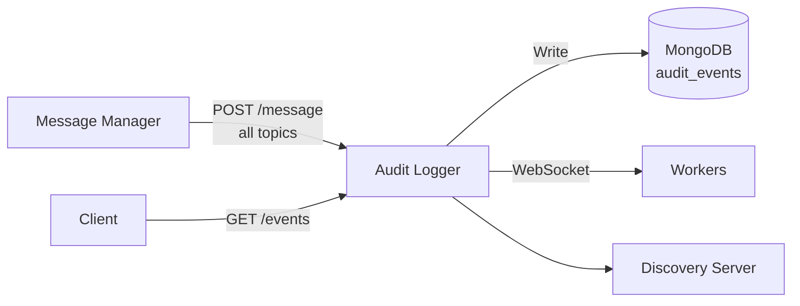

# Architecture — Audit Logger

## Overview

The Audit Logger provides immutable traceability for all platform events. It subscribes to every topic on the message bus, persists each event to MongoDB, and exposes a queryable REST API with pagination, filtering, and aggregate statistics.

## System Context



## Project Structure

```
services/audit-logger/
├── src/
│   ├── application/
│   │   ├── index.ts      # Entry point: bootstrap, MongoDB connect, broker subscription
│   │   ├── server.ts     # Express + WebSocket server factory
│   │   ├── broker-setup.ts       # Message bus subscription wiring
│   │   └── scheduler-factory.ts  # Scheduler composition root
│   ├── adapters/
│   │   ├── inbound/
│   │   │   └── subscription/audit-subscriber.ts  # Bus → repository ingestion
│   │   └── outbound/
│   │       └── persistence/      # Audit/log repository adapters
│   ├── domain/
│   │   └── scheduler/            # Job lifecycle, status & failure domain logic
│   ├── infrastructure/
│   │   ├── config/env.ts         # Zod-validated environment
│   │   └── repository-factory.ts
│   ├── persistence/              # MongoDB CRUD (audit-repository, job-repository, ...)
│   ├── scheduler/                # Priority-queue job scheduling
│   ├── worker/                   # WebSocket protocol for external workers
│   ├── controllers/              # HTTP request handlers
│   ├── routes/                   # Express route definitions
│   ├── subscription/             # Message parsing & log schemas
│   ├── config/                   # metrics, address-manager
│   ├── utils/                    # Query parameter helpers
│   └── types/                    # Worker & job type definitions
├── tests/
├── Dockerfile
├── package.json
└── tsconfig.json
```

## Layer Architecture

```
Message Bus (all topics)
    │
    ▼
BrokerMessage SDK ──→ onMessage handler
    │
    ▼
AuditRepository ──→ MongoDB (audit_events collection)
    │
    ▼
REST API (GET /events, GET /events/stats, GET /events/:id)
```

### Job Processing

```
JobScheduler ──→ Internal Queue (priority 1-5)
    │
    ▼
WorkerProtocol (WebSocket) ──→ External Workers
    │                         ACK / fail / complete
    ▼
JobRepository ──→ MongoDB (jobs collection)
```

## Key Design Decisions

- **Subscribes to ALL bus topics** — ensures no event is missed for audit purposes
- **MongoDB time-series friendly** — `audit_events` collection uses date-based indexing
- **Priority queue** — jobs are processed with priority levels 1-5
- **Worker protocol** — WebSocket-based for real-time job distribution with ACK/fail lifecycle
- **Retention** — configurable via `AUDIT_RETENTION_DAYS` (default 90 days)
- **Back-pressure** — returns 429 when `MAX_QUEUE_DEPTH` or `MAX_WORKER_LOAD_RATIO` exceeded
