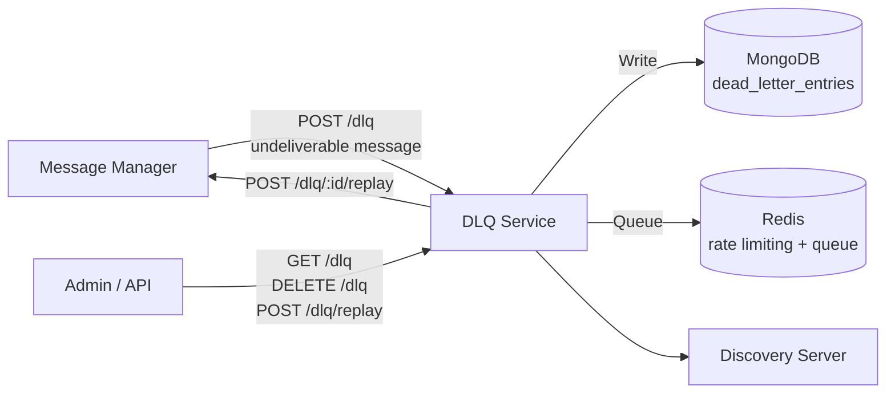

# Architecture — DLQ Service

## Overview

The DLQ Service manages messages that could not be delivered after exhausting retry attempts. It provides durable storage with MongoDB, fast queuing with Redis, and replay capability to re-inject entries into the message bus.

## System Context



## Project Structure

```
services/dlq-service/
├── src/
│   ├── app/
│   │   ├── index.ts      # Bootstrap: MongoDB connect, Redis queue, periodic prune
│   │   └── server.ts     # Express server factory
│   ├── config/
│   │   ├── env.ts        # Zod-validated environment
│   │   ├── address-manager.ts  # Service discovery client
│   │   ├── db.ts         # MongoDB connection manager
│   │   ├── redis-queue.ts      # Redis queue for DLQ operations
│   │   ├── metrics.ts    # Prometheus metrics
│   │   ├── audit.ts      # Audit logging
│   │   └── logger.ts     # Logger setup
│   └── dlq/
│       ├── controller.ts # Business logic: store, replay, retry, prune
│       ├── repository.ts # MongoDB CRUD for DLQ entries
│       └── routes.ts     # Express route definitions
├── tests/
├── Dockerfile
├── package.json
└── tsconfig.json
```

## Key Design Decisions

- **MongoDB persistence** — durable storage for dead letter entries with metadata and payload
- **Redis queue** — fast in-memory queue for pending retries and rate limiting
- **Stale claim release** — on startup, releases any claims orphaned by a previous crash
- **Periodic pruning** — configurable interval removes entries past `ENTRY_TTL_MS`
- **Automatic retry** — optional (disabled by default), automatically re-attempts delivery
- **Degraded mode** — if Redis is unavailable, operations continue (without queue)
- **TLS hot-reload** — on certificate renewal, HTTP client TLS config is reloaded without restart
