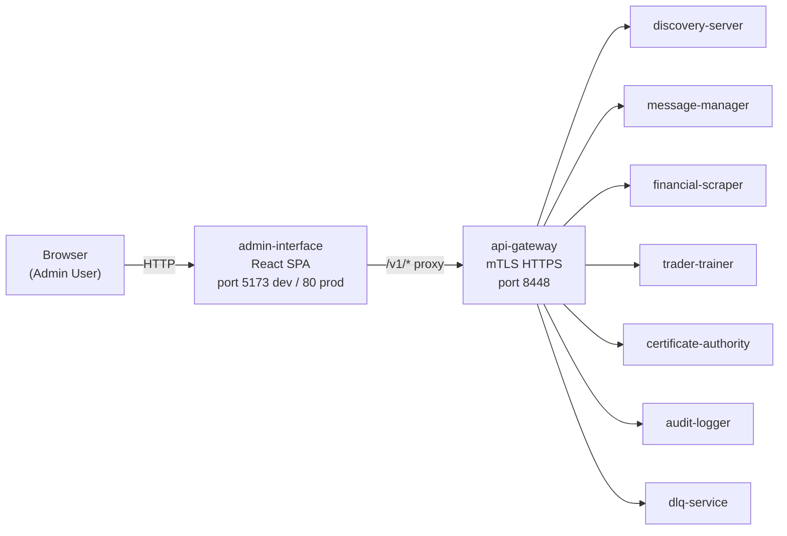
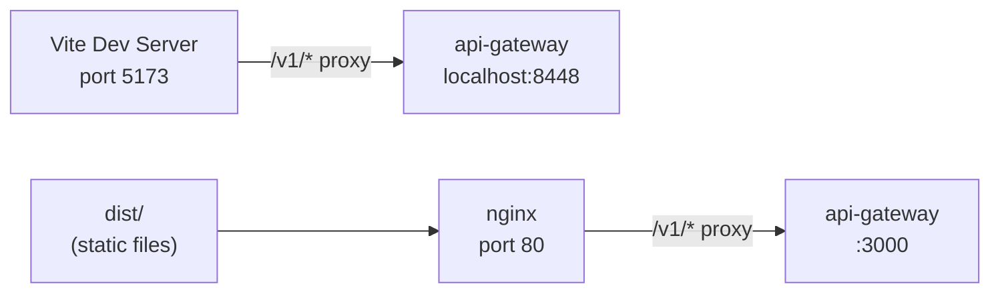

# Architecture — Admin Interface

## Overview

The Admin Interface is a **React 19 SPA** that provides a unified administrative dashboard for the trading-model platform. It is not a Node.js microservice — it is a static web application built with Vite and served via nginx in production. All backend communication goes through the **api-gateway**.

## System Context



## Project Structure

```
services/admin-interface/
├── index.html                # Vite SPA entry HTML
├── vite.config.ts            # Vite config (dev proxy, React plugin)
├── vitest.config.ts          # Vitest config (jsdom, 100% coverage)
├── tsconfig.app.json         # TypeScript config (ES2022, DOM, bundler)
├── nginx.conf                # Production nginx config
├── Dockerfile                # Multi-stage build (Node 26 -> nginx:alpine)
├── src/
│   ├── main.tsx              # React entry (StrictMode, ThemeProvider, CssBaseline)
│   ├── app.tsx               # BrowserRouter + route definitions
│   ├── theme.ts              # MUI theme (palette, typography, component overrides)
│   ├── api/
│   │   └── api-client.ts     # Fetch-based HTTP client with error handling
│   ├── components/           # Reusable UI components
│   ├── hooks/                # Data-fetching hooks
│   ├── pages/                # Route-level page components
│   ├── i18n/                 # Internationalization (en, fr)
│   └── types/
│       └── dtos.ts           # DTO types from @trading-model/common/contracts/admin
└── tests/
    ├── unit/                 # Component & hook unit tests
    ├── integration/          # Page-level integration tests
    └── helpers/              # Test utilities (setup, wrappers)
```

## Layer Architecture

```
┌──────────────────────────────────────────────────────┐
│                     main.tsx                          │
│  StrictMode → ThemeProvider (MUI) → CssBaseline → App │
└──────────────────────────────────────────────────────┘
                          │
┌──────────────────────────────────────────────────────┐
│                     app.tsx                           │
│  I18nextProvider → BrowserRouter → Routes → Layout    │
│    / → redirect /services                             │
│    /services → <Services />                           │
│    /certificates → <Certificates />                   │
│    /audit/events → <AuditEvents />                    │
│    /jobs → <Jobs />                                   │
│    /broker/dlq → <Dlq />                              │
│    /training/results → <TrainingResults />             │
│    /cache → <Cache />                                  │
│    /workers → <Workers />                              │
│    /market-data → <MarketData />                      │
│    /config → <Config />                                │
└──────────────────────────────────────────────────────┘
                          │
┌──────────────────────────────────────────────────────┐
│                  Components                           │
│  ┌─────────┐ ┌────────────┐ ┌──────────┐             │
│  │ Sidebar │ │ Layout     │ │ Outlet   │             │
│  └─────────┘ └────────────┘ └──────────┘             │
│  ┌─────────┐ ┌────────────┐ ┌──────────┐             │
│  │DataTable│ │ FilterBar  │ │StatsCard │             │
│  └─────────┘ └────────────┘ └──────────┘             │
│  ┌─────────┐ ┌────────────┐ ┌──────────┐             │
│  │Drawer   │ │StatusBadge │ │Severity  │             │
│  │Panel    │ │            │ │Badge     │             │
│  └─────────┘ └────────────┘ └──────────┘             │
│  ┌─────────┐ ┌────────────┐                           │
│  │Modal    │ │ InfoBox    │                           │
│  │Confirm  │ │            │                           │
│  └─────────┘ └────────────┘                           │
└──────────────────────────────────────────────────────┘
                          │
┌──────────────────────────────────────────────────────┐
│            Hooks → API Client → Backend               │
│  useServices() → api.getServices() → /v1/discovery/*  │
│  useAuditEvents() → api.getAuditEvents() → /v1/audit/*│
│  useJobs() → api.getJobs() → /v1/jobs/*               │
│  useApi<T>(fetcher) — generic loading/error/data       │
└──────────────────────────────────────────────────────┘
```

## Component Architecture

| Component         | Props                                       | Purpose                                           |
| ----------------- | ------------------------------------------- | ------------------------------------------------- |
| **Layout**        | —                                           | Shell: sidebar + `<Outlet />` + footer            |
| **Sidebar**       | —                                           | 10-item nav with MUI icons, search, user avatar   |
| **DataTable**     | `columns`, `rows`, `sortable`, `selectable` | Generic table with pagination, sort, multi-select |
| **FilterBar**     | `onSearch`, `filters`, `onApply`            | Search field + dropdown filters + Apply/Reset     |
| **DrawerPanel**   | `open`, `tabs`, `onClose`                   | Right-side detail drawer with tabbed content      |
| **StatsCard**     | `icon`, `value`, `label`, `delta`           | Metric display card                               |
| **StatusBadge**   | `status`                                    | Colored MUI Chip (healthy/degraded/down)          |
| **SeverityBadge** | `severity`                                  | Colored MUI Chip (INFO/WARNING/ERROR/CRITICAL)    |
| **ModalConfirm**  | `open`, `title`, `onConfirm`, `onCancel`    | Action confirmation dialog with impact summary    |
| **InfoBox**       | `icon`, `title`, `children`                 | Alert/info card with contextual message           |

## Data Flow

### Read Operations (e.g., Service List)

```
User navigates to /services
  → Layout renders Sidebar + Outlet
  → Services page mounts
    → useServices() → useApi<T>() calls api.getServices()
      → fetch /v1/discovery/registry with x-api-key header
        → api-gateway proxies to discovery-server
        → discovery-server returns ServiceRegistry
      → parse JSON into typed DTOs
    → loading=true → spinner
    → data received → render DataTable + StatsCards
```

### Write Operations (e.g., Revoke Certificate)

```
User clicks "Revoke" on certificate row
  → ModalConfirm opens with warning
  → User confirms
    → api.revokeCertificate(certId)
      → POST /v1/ca/revoke { certificateId }
    → on success, refetch certificate list
    → on error, display ApiError message
```

## State Management

There is **no global state library** (no Redux, Zustand, etc.). Each page manages its own data via the `useApi<T>` custom hook:

```typescript
function useApi<T>(
  fetcher: () => Promise<T>,
  deps: unknown[] = []
): {
  data: T | null; // Response data (null before first fetch)
  loading: boolean; // True during fetch
  error: string | null; // Error message or null
  refetch: () => void; // Manual re-fetch trigger
};
```

Key design points:

- `useRef` tracks mounted state to prevent state updates after unmount
- `error` is typed as `ApiError` when the server returns HTTP errors
- `deps` array controls when to automatically re-fetch (e.g., `[JSON.stringify(params)]`)

## Routing

All routes are nested under a single `<Layout>` component:

| Route               | Page                   | Description                          |
| ------------------- | ---------------------- | ------------------------------------ |
| `/`                 | Redirect → `/services` | Default landing                      |
| `/services`         | `Services`             | Service registry + network topology  |
| `/certificates`     | `Certificates`         | Certificate list + revocation        |
| `/audit/events`     | `AuditEvents`          | Paginated audit log with topic chart |
| `/jobs`             | `Jobs`                 | Job queue with detail drawer         |
| `/broker/dlq`       | `Dlq`                  | Dead letter queue management         |
| `/training/results` | `TrainingResults`      | Training results + genome inspection |
| `/cache`            | `Cache`                | API gateway cache management         |
| `/workers`          | `Workers`              | Worker node monitoring               |
| `/market-data`      | `MarketData`           | Candles chart, order book, tickers   |
| `/config`           | `Config`               | Service configuration viewer         |

## i18n

Internationalization is handled by **i18next** + **react-i18next** with two locales:

- **en** — English (default)
- **fr** — French

Language detection uses `navigator.language`. Each page's labels, tooltips, and confirmation messages are fully translated.

## Production Deployment



**Development:** Vite dev server runs on port 5173 with HMR. API calls to `/v1/*` are proxied to `https://localhost:8448` (api-gateway).

**Production:** The Docker image serves the built SPA via nginx on port 80. `/v1/*` requests are proxied to the api-gateway service at `https://api-gateway:3000`. SPA fallback routes return `index.html` for client-side routing.

## Docker Build

Multi-stage build (see `Dockerfile`):

1. **Build stage** (`node:26-alpine`) — `npm ci` + `npm run build` (tsc + vite)
2. **Runtime stage** (`nginx:alpine`) — serves `dist/` via nginx

Health check: `wget -qO- http://localhost:80/ping || exit 1`

## Dependencies

**Production:**

| Package                                | Purpose                                                 |
| -------------------------------------- | ------------------------------------------------------- |
| `react`, `react-dom`                   | UI framework                                            |
| `@mui/material`, `@mui/icons-material` | Material-UI components                                  |
| `@emotion/react`, `@emotion/styled`    | MUI styling engine                                      |
| `react-router-dom`                     | Client-side routing (BrowserRouter)                     |
| `recharts`                             | Charts (audit volume bar chart, market data area chart) |
| `i18next`, `react-i18next`             | Internationalization                                    |
| `@trading-model/common`                | Shared DTOs (`contracts/admin`)                         |

**Development:**

| Package                                               | Purpose                   |
| ----------------------------------------------------- | ------------------------- |
| `vite` + `@vitejs/plugin-react`                       | Build tool                |
| `vitest` + `@vitest/coverage-v8`                      | Test runner               |
| `@testing-library/react`, `@testing-library/jest-dom` | React component testing   |
| `jsdom`                                               | DOM environment for tests |
| `typescript`                                          | TypeScript compiler       |
| `eslint`                                              | Linting                   |

## Testing Strategy

- **Unit tests**: Components (DataTable, DrawerPanel, FilterBar, badges, StatsCard), hooks (useApi), API client, i18n config, theme
- **Integration tests**: App shell rendering + route navigation, page-level loading/error/data states
- **Coverage target**: 100% on all source files (excluding `vite-env.d.ts` and `main.tsx`)
- **Environment**: jsdom with global `fetch` mock
