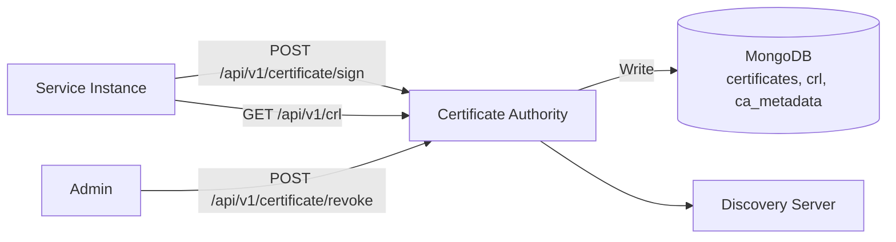

# Architecture — Certificate Authority

## Overview

The Certificate Authority manages the full lifecycle of X.509 certificates used for mTLS authentication across all platform services. It handles CSR signing, automatic rotation, certificate revocation (CRL), and secure distribution.

## System Context



## Project Structure

```
services/certificate-authority/
├── src/
│   ├── app/
│   │   ├── index.ts           # Bootstrap
│   │   ├── server.ts          # Express + WebSocket server
│   │   ├── container.ts       # DI container wiring
│   │   ├── health.routes.ts   # Health check endpoints
│   │   └── ws-server.ts       # WebSocket server for streaming
│   ├── config/
│   │   └── env.ts             # Zod-validated environment
│   ├── controllers/
│   │   ├── certificate.controller.ts  # Sign, get, revoke handlers
│   │   ├── crl.controller.ts          # CRL publication
│   │   └── health.controller.ts       # Health status
│   ├── core/
│   │   ├── ca.ts              # Root CA operations (key generation, self-sign)
│   │   ├── distributor.ts     # Certificate distribution to services
│   │   ├── key-rotator.ts     # CA key rotation
│   │   └── rotator.ts         # Scheduled certificate renewal
│   ├── persistence/
│   │   ├── ca-store.ts        # CA metadata persistence
│   │   ├── certificate-store.ts  # Certificate CRUD
│   │   ├── crl-store.ts       # CRL persistence
│   │   ├── audit-store.ts     # Certificate audit log
│   │   ├── distributed-lock.ts    # Distributed lock for HA
│   │   ├── fs-store.ts        # Filesystem-based key store
│   │   ├── mongo-manager.ts   # MongoDB connection manager
│   │   ├── nonce-store.ts     # Nonce management
│   │   ├── redis-cache.ts     # Redis cache layer
│   │   └── token-store.ts     # Token store
│   ├── signing/
│   │   └── ...                # Signing providers
│   ├── middleware/
│   │   └── ...                # Custom middleware
│   └── monitoring/
│       └── ...                # Metrics and monitoring
├── tests/
├── Dockerfile
├── package.json
└── tsconfig.json
```

## Key Design Decisions

- **RSA 4096-bit CA key** — generated on first start, persisted to MongoDB and disk (`CA_KEY_PATH`)
- **Hierarchical CA** — supports root + intermediate CA mode via `ROOT_CA_CERT_PATH`
- **MongoDB persistence** — certificates, CRL entries, and CA metadata in separate collections
- **Automatic rotation** — scheduled task checks for expiring certificates at configurable interval
- **Distributed locking** — ensures only one CA instance performs rotation in HA deployments
- **WebSocket server** — for streaming certificate updates to connected services
- **OIDC integration** — optional OpenID Connect verifier for admin authentication
